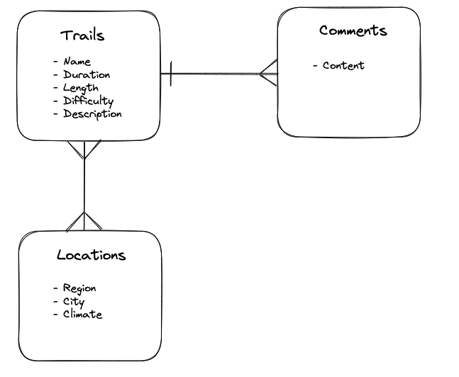

# Project-04
## The Hiking Club
### Overview

For my fourth and final project, I have created an app for people that share my passion for hiking and want to explore the outdoors. The app allows users to filter through different regions of the UK to see locations of hikes which they may want to experience. Furthermore, the user can create a password protected account on the app which allows them to upload hikes they discover and want to share with the community. This was a solo project which was completed over the span of 2 weeks and incorporates a frontend, backend, API and database.

### Deployment link

To view the app, click here : https://trails-project4.netlify.app

### Technical Requirements

* **Build a full-stack application** by making my own backend and my own frontend.
* **Use a Python Flask API** using a Flask REST Framework to serve my data from a Postgres database.
* **Consume my API with a separate front-end** built with React.
* **Be a complete product** which includes multiple relationships and CRUD functionality for models.
* **Be deployed online** so it's publicly accessible.


### Technologies

Technologies used to design this app included the following:

* TypeScript
* Python
* Postgres
* React
* Flask
* SqlAlchemy
* Insomnia
* Tableplus
* Git and GitHub
* Netlify
* Fly.io
* Bit.io

## Planning


## Build

### Backend

An MVC approach was used on this project where models were firstly created to describe the different components of the app. Along with this, controllers were created to describe the methods for retrieving information via SQL from the postgreSQL database with the use of serializers to allow Python to communicate with the database. These serializers are described within the schemas for each of the models.

On this project, I used the Flask library which allowed me to incorporate flask-SQLAlchemy and marshmallow. PostgreSQL was used as a means to store the apps required data as tables of rows and columns within a relational SQL database, with relationships between the models. To test this on our local server, TablePlus was used. Object relational mapping (ORM) must be considered meaning I must convert between Python objects and database tables.

Considerations had to be made on the type of relationship between each of the models. To plan this, an ERD (Entity Relationship Diagram) was mapped out to visualise the concepts.





The relationship describes the model which refers to the classes of the individual trail model and location model. Secondly it contains a backpopulates method which describes the other side of the relationship and shows the connections between the models. SQLAlchemy must be told what the relationships are so that it can both make the tables in the database and allow me to do serialisation and to allow one models data to be nested within another. The relationships are described in the models as follows:

* Trail Model:
```
comments = db.relationship('CommentModel', backref='comments', cascade='all, delete')
  locations = db.relationship("TrailLocationModel", back_populates="trail")
  user = db.relationship("UserModel", back_populates="trail")
```

* Location Model:
```
trails = db.relationship('TrailLocationModel', back_populates="location")
```

* Trail_Location Model:
```
trail = db.relationship("TrailModel", back_populates="locations")
  location = db.relationship("LocationModel", back_populates="trails")

```


A trail location model contains a single trail and single location as these are being connected. This creates a unique pairing and individual row in the SQL table. Similarly, connections are made between the user model and the trails model to allow us to keep track of which user posted which trail and permissions can be implemented on the trail. This also allows us to search by user on frontend if required. This demonstrates a one to many relationship as many trails can be owned by a single user.

```
trail = db.relationship("TrailModel", back_populates="user")
```


Serialisation and de-serialisation was a technique used within the backend. Serialisation was required to convert objects into a transferrable format that can be sent or communicated whilst de-serialisation to convert JSON to Python objects. This was shown with the use of schemas such as:

```
class TrailSchema(ma.SQLAlchemyAutoSchema):

  comments = fields.Nested('CommentSchema', many=True)
  locations = fields.Nested("TrailLocationSchema", many=True)

  class Meta:
    model = TrailModel
    load_instance = Trueinclude_fk = True
    include_fk = True
```


## Authentication/Authorization

Authentication and authorization played a major role in this project. It was important to incorporate this to allow users to make an account and securely log in. A ```secure route``` file was made to include the token for a user. JSON web token (JWT) was used as the protocol for authentication which involved a secure token creation when signing up and is implemented when logging in or when a user chooses to upload a trail. An element of this is the password hash function in the user model:

```
 @hybrid_property
    def password(self):
        pass

    @password.setter
    def password(self, password_plaintext):
        encoded_pw = bcrypt.generate_password_hash(password_plaintext)
        self.password_hash = encoded_pw.decode("utf-8")
```

Similarly to this, the validate password function is run to log in:

```
   def validate_password(self, password_plaintext):
       return bcrypt.check_password_hash(self.password_hash, password_plaintext)
```

This is also used in the serializer/deserializer process in the user controller:

```
user = user_schema.load(user_dictionary)
```
```
return user_schema.jsonify(user)
```

### Frontend


Starting off the frontend, I used Excalidraw to sketch different front page layouts and explore how I wanted the frontpage to render to attract the user. This helped me understand the different pages I wanted to include, how I wanted the user to experience navigating from page to page and finally what would be included on the navbar for a general user as well as once a user is logged in as this would provide different options. React was used as the foundation to build the frontend.

The several components on the frontend included the following methods:

* ```useEffect``` was used to run a section of code every time a specific part of state changes on the rendered screen. Within this, ```promises``` were used to run async functions to retrieve information from an API:

```
React.useEffect(() => {
    async function fetchTrails() {
      const resp = await fetch(`${baseUrl}/trails/${trailId}`)
      const TrailsData = await resp.json()
      updateTrails(TrailsData)
      console.log(TrailsData);
      
    }
    fetchTrails()
  }, [])
```


* ```useState``` was used to tell React to remember an action such as a change on the screen. For example, a variable - const [newTrail, setNewTrail] is created to show different parameters the user can add when posting a new trail from their account.

```
  const [newTrail, setNewTrail] = useState({
    name: "",
    duration: "",
    description: "",
    length: "",
    difficulty: "",
    image: "",
    map: ""
  })
```


* Event handling was used to run a section of code when commanded by the user e.g. a submit button runs the below code when adding a new trail post. When the code is run, the information is posted through ```axios``` to the trails database:

```
 async function handleSubmit(e: SyntheticEvent) {
    e.preventDefault()
    try {
      const token = localStorage.getItem('token')
      const { data } = await axios.post(`${baseUrl}/trails`, newTrail, {
        headers: { Authorization: `Bearer ${token}` }
      })
      console.log(data)
      navigate('/trails')
    } catch (err: any) {
      setErrorData(err.response.data.errors)
    }
  }
```

* Props are used which incorporates a parent child relationship and allows data to be used within a function. The interface must also be included to let the app know what the data type is. The below example is taken from the TrailCard component which is rendered when the user selects an individual trail card:

```
function TrailCard({ id, name, duration, length, difficulty, image, description, map }: ITrail) {
  return ()
  
 }
```

Another similar method used was the ```spreader``` function which included all props from an ```Interface```:

```
<div className="row">
            {trails?.map((trail: ITrail) => {
              return <Trails
                key={trail.id}
                {...trail}
              />
            })}
          </div>
```


* React router:
Within the app file of the project, all of the routes to each page are shown. Routes are used to ensure the page does not reload however the components in the page are controlled by the routes, examples below:

```
<Router>
      <Navbar user={user} setUser={setUser} />
      <main>
        <Routes>
          <Route path="/" element={<Home />} />
          <Route path="/trails" element={<TrailList />} />
          <Route path="/signup" element={<Signup />} />
          <Route path="/login" element={<Login fetchUser={fetchUser}/>} />
          <Route path="/addtrail" element={<AddTrail />} />
          <Route path="/trails/:trailId" element={<ShowTrail />} />
        </Routes>
      </main>
    </Router>
```


* Links are used to redirect the user to another page without reloading the page. This example is included on the list of trail cards. When a card is selected, this link is loaded and the user is taken to the individual card page which includes a more in-depth description. This fetches information from the database by calling the trails unique ID:

```
<Link to={`/trails/${id}`} className="col-sm-6 col-md-4">
      
    </Link>
```


* Hooks - ```useParams``` is used to allow me to retrieve variables from a route:
```
const { trailId } = useParams()
```

```useNavigate``` is used to give me a navigation function that could be used to redirect the page. For example, the below code is run when a new trail is submitted by a user, the user is automatically navigated to the home page.
```
navigate('/')
```

## Challenges

The biggest challenge of this project was understanding and implementing the various types of relationships between the models. Thought was required on which elements should be nested in others and how this would translate from the backend to the frontend in a way that was user-friendly.

## Wins

I was successfully able to work through the problems I faced during this project by breaking down the problem into smaller, manageable issues and creating a product which allows the user to explore and interact with different components. I also feel like this app aesthetically looks professional and it allowed me to get creative with CSS with the use of Bootstrap. I was able to successfully demonstrate my knowledge of creating a secure app where users can create password protected accounts and contribute their experience with the rest of the world.

## Future Additions

I would like to continue working on this project in the future and add the following components:
* Add a comments section on each expanded card where different users can post their reviews of each trail they experience.
* Google maps API to show specific locations of each hike rather than a general map on the homepage.
* Expand the brand by adding a hiking gear and apparel page.
